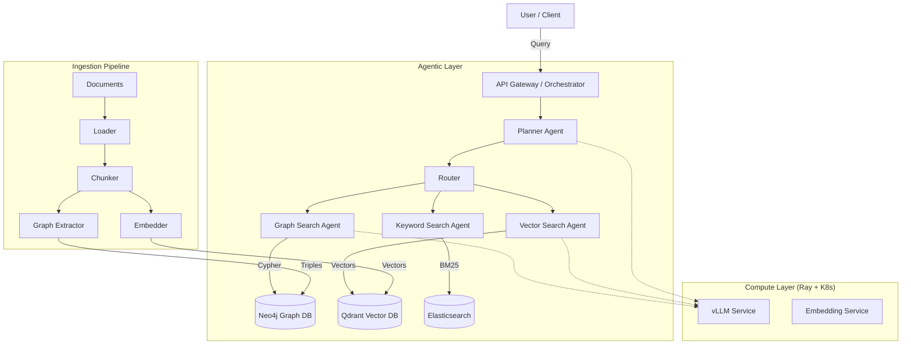

# Comprehensive Implementation Plan: Scalable Agentic RAG Transformation (GABI)

## 1. Executive Summary

This document outlines the strategic roadmap to transform the **GABI** platform from a legal document search engine (PostgreSQL + Elasticsearch) into a scalable, enterprise-grade **Agentic RAG System** inspired by Fareed Khan's reference architecture.

**Target Architecture Goals:**
*   **Multi-Agent Orchestration:** Transition from linear pipelines to dynamic agentic workflows (Planner, Graph Search, Vector Search).
*   **Graph Knowledge:** Introduce Neo4j to model complex legal relationships (citations, jurisprudence).
*   **Scalable Inference:** Implement Ray Serve and vLLM for high-throughput LLM serving.
*   **Specialized Vector Search:** Migrate vector workloads to Qdrant for performance and flexibility.
*   **Cloud-Native Operations:** Establish robust DevOps practices with Helm, Terraform, and comprehensive observability.

---

## 2. Current State vs. Target State Gap Analysis

| Component | Current State (GABI) | Target State (Reference) | Gap / Action |
| :--- | :--- | :--- | :--- |
| **Orchestration** | Linear Pipeline (Discovery -> Index) | **Multi-Agent System** (LangGraph/CrewAI) | **Critical:** Implement Agentic logic. |
| **Vector DB** | PostgreSQL (`pgvector`) | **Qdrant** (Dedicated) | **High:** Migrate for scale/features. |
| **Graph DB** | None | **Neo4j** | **Critical:** Add for legal citation network. |
| **LLM Serving** | TEI (Embeddings only) | **vLLM + Ray Serve** | **High:** Add generative capabilities. |
| **Search Logic** | Hybrid (BM25 + Vector) | **Graph + Vector + BM25** | **High:** Integrate Graph traversal. |
| **Infrastructure** | Docker Compose / Simple K8s | **Helm + Terraform + AWS** | **Medium:** Professionalize deployment. |
| **Observability** | Prometheus (Basic) | **Grafana + OpenTelemetry** | **Medium:** Full tracing and dashboards. |

### 2.1 Detailed Codebase Assessment (Performed 2026-02-08)

A deep-dive analysis of the current codebase confirms the following state:

*   **Orchestration (`src/gabi/pipeline/orchestrator.py`):**
    *   Implements a STRICTLY LINEAR pipeline (`discovery` -> `fetch` -> ... -> `index`).
    *   Uses `asyncio.gather` for concurrency but lacks dynamic decision-making or feedback loops key to agentic workflows.
    *   No existing "Agent" classes or LangChain/LangGraph integration found.

*   **Search Services (`src/gabi/services/search_service.py`):**
    *   Successfully implements Hybrid Search (BM25 via ES + Vector via `pgvector`/ES-kNN).
    *   Uses Reciprocal Rank Fusion (RRF) for result combining.
    *   **Limitation:** Vector search is tightly coupled to the configured backend key (`vector_search_backend`), making the migration to Qdrant a replacement task rather than just configuration.
    *   **Graph:** No logic exists for graph traversal or entity relationship handling.

*   **Infrastructure (`docker-compose.yml`):**
    *   **Vectors:** `pgvector/pgvector:pg15` is critical infrastructure currently.
    *   **Embeddings:** `ghcr.io/huggingface/text-embeddings-inference:1.4` running `paraphrase-multilingual-MiniLM-L12-v2` (384d). This model is small and efficient but may limit reasoning capabilities compared to larger models needed for agentic tasks.
    *   **Missing:** No Neo4j, Qdrant, vLLM, or Ray containers are defined.

*   **Configuration (`src/gabi/config.py`):**
    *   Robust Pydantic settings are in place.
    *   **Action:** Will need to extend `Settings` to support `NEO4J_URL`, `QDRANT_URL`, `VLLM_URL`, and `RAY_ADDRESS`.

---

## 3. Phased Implementation Roadmap

### Phase 1: Foundation & Infrastructure (Weeks 1-2)
**Goal:** Deploy core infrastructure components required for the new architecture.

1.  **Graph Database (Neo4j):**
    *   Deploy Neo4j Community/Enterprise via Docker/K8s.
    *   Define graph schema for legal documents (Nodes: `Document`, `Law`, `Person`; Edges: `CITES`, `AMENDS`, `AUTHORED_BY`).
2.  **Vector Database (Qdrant):**
    *   Deploy Qdrant cluster.
    *   Migrate existing embeddings from `pgvector` to Qdrant collections.
3.  **Observability Stack:**
    *   Deploy Grafana and connect to Prometheus.
    *   Setup Jaeger/OpenTelemetry for trace collection.

### Phase 2: Knowledge Graph Construction (Weeks 3-4)
**Goal:** Extract and index relationships to enable Graph RAG.

1.  **Graph Extraction Pipeline:**
    *   Implement an extraction agent (using LLM or regex) to identify citations and entities during ingestion.
    *   Update `Indexer` service to write relationships to Neo4j.
2.  **Graph Synchronization:**
    *   Ensure consistency between Postgres (metadata), Qdrant (vectors), and Neo4j (graph).

### Phase 3: Agentic Core Implementation (Weeks 5-6)
**Goal:** Replace linear search with a multi-agent orchestrated system.

1.  **Orchestrator Agent (The "Brain"):**
    *   Implement a master agent using **LangGraph** or **LangChain**.
    *   Capabilities: Query decomposition, routing, and synthesis.
2.  **Specialized Sub-Agents:**
    *   **Vector Search Agent:** Queries Qdrant for semantic similarity.
    *   **Graph Search Agent:** Traverses Neo4j for citation hopping (e.g., "Find all laws citing Law X").
    *   **Keyword Agent:** Queries Elasticsearch for precise term matching.
3.  **Planner Agent:**
    *   Breaks down complex legal questions into sub-tasks (e.g., "Summarize the evolution of Law Y and compare with Law Z").

### Phase 4: Serving & Inference (Weeks 7-8)
**Goal:** Scale LLM and embedding inference.

1.  **Ray Serve Integration:**
    *   Deploy Ray cluster on K8s.
    *   Wrap embedding models and LLMs as Ray deployments.
2.  **vLLM Deployment:**
    *   Deploy vLLM for high-performance token generation (supporting Llama 3, Mistral, etc.).
    *   Expose OpenAI-compatible API for internal agents.

### Phase 5: Production Readiness (Weeks 9-10)
**Goal:** Harden the system for production use.

1.  **Helm Charts:** Create modular charts for the entire stack.
2.  **Terraform:** Script AWS/Cloud infrastructure provisioning.
3.  **Security:** Implement comprehensive RBAC, networked policies, and secret management.
4.  **Load Testing:** Validate system performance under concurrent agent workloads.

---

## 4. Technical Architecture Diagram (Target)

## 5. Immediate Next Steps

1.  **Approval:** Confirm this roadmap aligns with business priorities.
2.  **Repo Restructure:** Create `services/graph_service` and `services/agent_service`.
3.  **Prerequisites:** Ensure sufficient compute resources (GPU availability) for vLLM and Ray.
