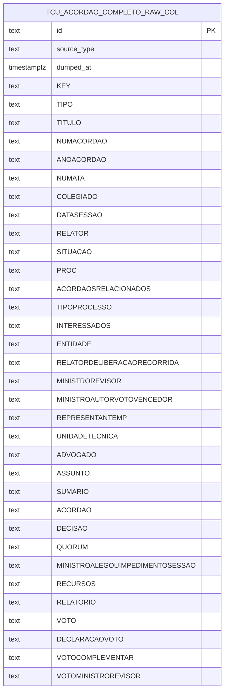
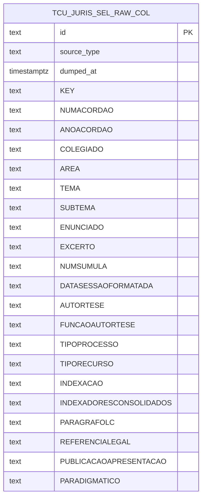
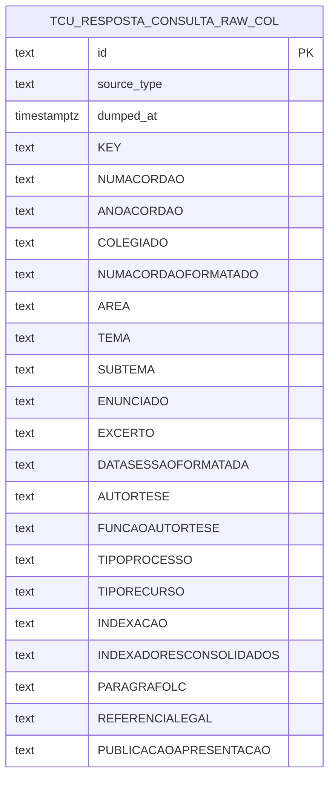
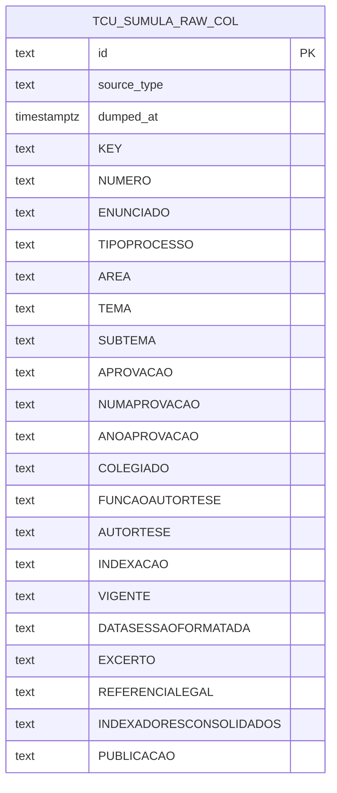
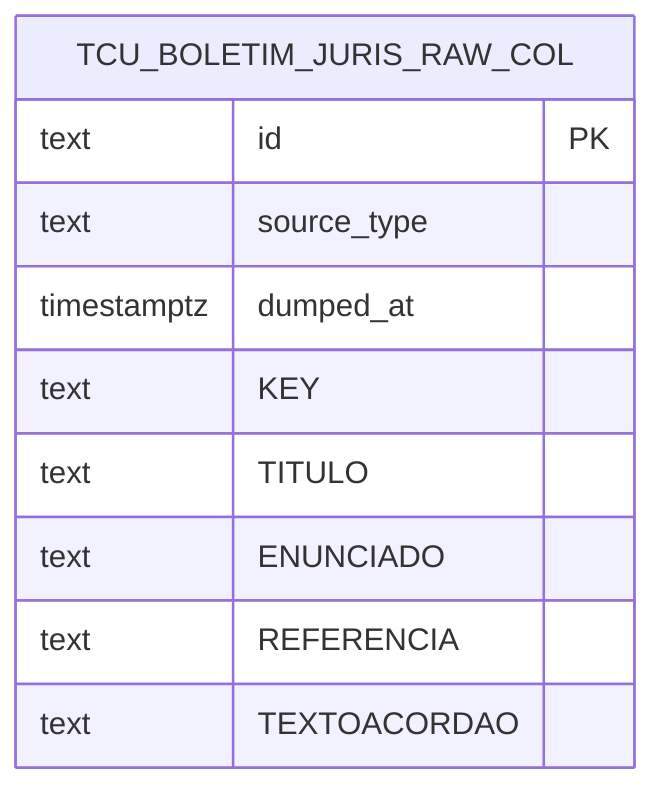
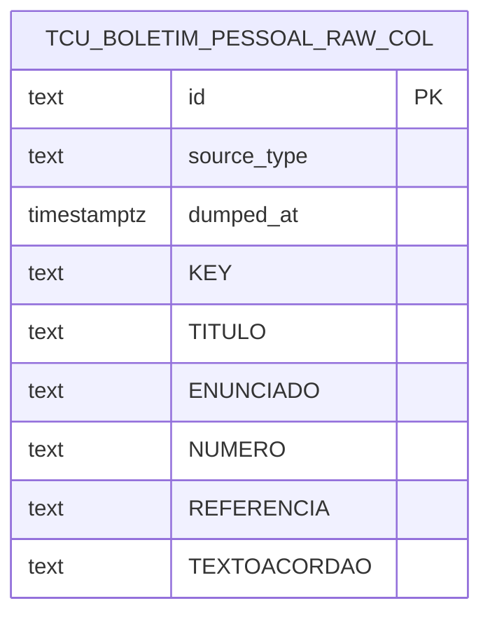
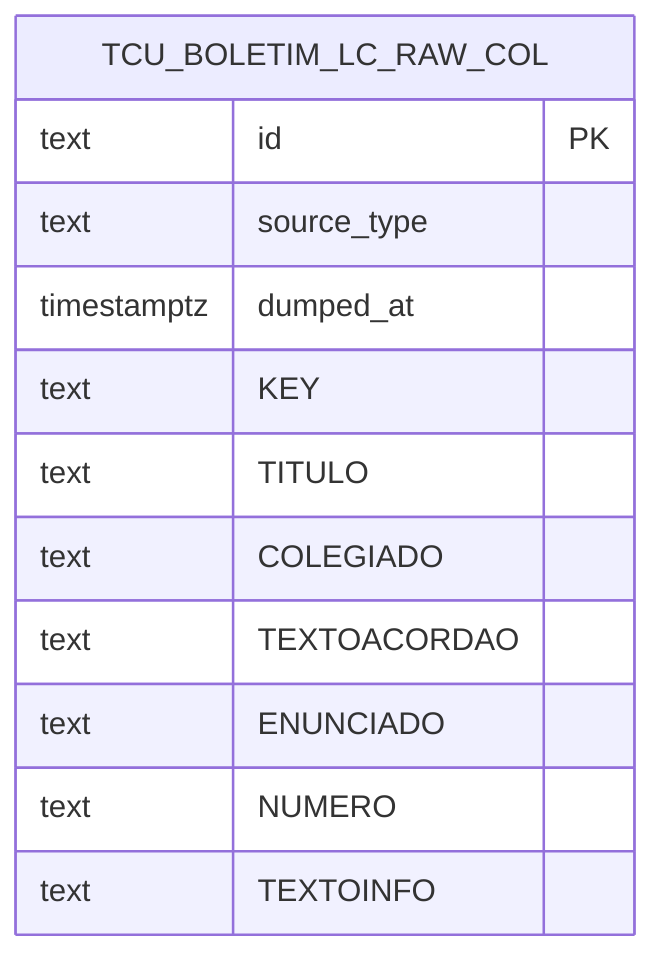
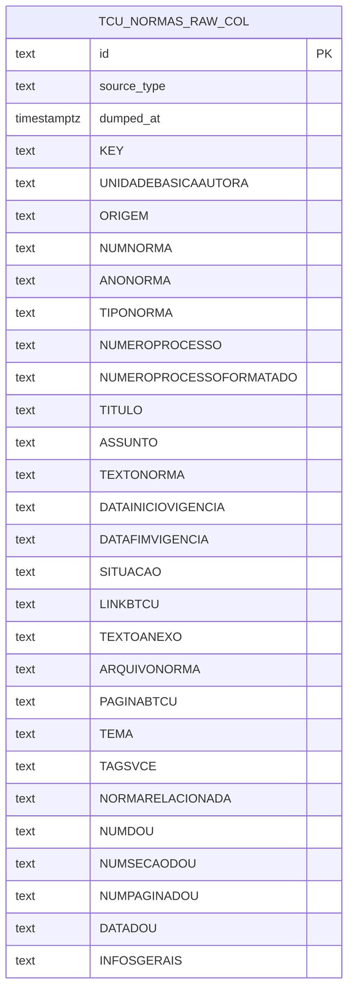
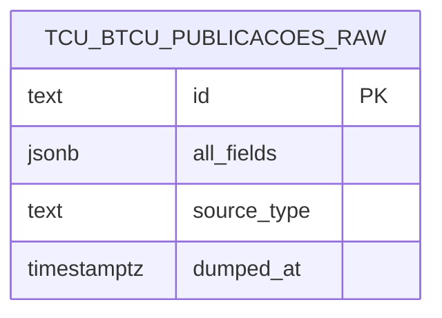

# Diagrama estilo ERM — schema `raw.*` (Postgres)

**SoT:** onze tabelas canónicas (`raw.dou_documents_raw` + oito `raw.tcu_*_raw` de CSV + `raw.tcu_normas_raw` + `raw.tcu_btcu_raw` + `raw.tcu_publicacoes_raw`) + `raw.tcu_csv_fetch_meta`. Ingest activo não deve escrever em `*_raw_data` (legado — arquivar após backfill).

Sem linhas de relacionamento (não há FKs declaradas entre estas tabelas). Duas formas de armazenamento TCU coexistem no código:

| Padrão | Onde | Colunas |
|--------|------|---------|
| **Envelope JSONB** | `ops/migrations/source_separate_raw.py`, staging `*_raw_data` | `id`, `all_fields` (JSONB), `source_type` (quando aplicável), `dumped_at` / `migrated_at` |
| **Colunar CSV** | `src/backend/ingest/tcu_csv_raw_pg.py` (`ensure_source_table`) | `id`, `source_type`, `dumped_at` + uma coluna `TEXT` por cabeçalho do CSV TCU |

Os nomes de entidade abaixo usam alias Mermaid (sem ponto). O nome físico completo é `raw.<nome>`.

---

## 1. Visão geral — todas as tabelas `raw.*` relevantes

```mermaid
erDiagram
  DOU_DOCUMENTS_RAW_DATA {
    text id PK
    date pub_date
    text section
    text source_zip
    text art_type
    text content_html
    text raw_html_hash
    jsonb all_fields
    timestamptz migrated_at
  }

  DOU_DOCUMENTS_RAW {
    text id PK
    jsonb all_fields
    text source_type
    timestamptz dumped_at
  }

  TCU_ACORDAOS_RAW_DATA {
    text id PK
    jsonb all_fields
    timestamptz dumped_at
  }

  TCU_NORMAS_RAW_DATA {
    text id PK
    jsonb all_fields
    timestamptz dumped_at
  }

  TCU_BTCU_RAW_DATA {
    text id PK
    jsonb all_fields
    timestamptz dumped_at
  }

  TCU_PUBLICACOES_RAW_DATA {
    text id PK
    jsonb all_fields
    timestamptz dumped_at
  }

  TCU_CSV_FETCH_META {
    text url PK
    text content_sha256
    bigint bytes_size
    timestamptz fetched_at
    text response_etag
  }

  TCU_ACORDAO_COMPLETO_RAW {
    text id PK
    jsonb all_fields
    text source_type
    timestamptz dumped_at
  }

  TCU_JURISPRUDENCIA_SELECIONADA_RAW {
    text id PK
    jsonb all_fields
    text source_type
    timestamptz dumped_at
  }

  TCU_RESPOSTA_CONSULTA_RAW {
    text id PK
    jsonb all_fields
    text source_type
    timestamptz dumped_at
  }

  TCU_SUMULA_RAW {
    text id PK
    jsonb all_fields
    text source_type
    timestamptz dumped_at
  }

  TCU_BOLETIM_JURISPRUDENCIA_RAW {
    text id PK
    jsonb all_fields
    text source_type
    timestamptz dumped_at
  }

  TCU_BOLETIM_PESSOAL_RAW {
    text id PK
    jsonb all_fields
    text source_type
    timestamptz dumped_at
  }

  TCU_BOLETIM_INFORMATIVO_LC_RAW {
    text id PK
    jsonb all_fields
    text source_type
    timestamptz dumped_at
  }

  TCU_NORMAS_RAW {
    text id PK
    jsonb all_fields
    text source_type
    timestamptz dumped_at
  }

  TCU_BTCU_RAW {
    text id PK
    jsonb all_fields
    text source_type
    timestamptz dumped_at
  }

  TCU_PUBLICACOES_RAW {
    text id PK
    jsonb all_fields
    text source_type
    timestamptz dumped_at
  }
```

---

## 2. `raw.tcu_acordao_completo_raw` — colunas do CSV (acórdão completo)

Fonte: `CSV_COLUMNS` em `src/backend/ingest/tcu_processor.py`.

---

## 3. `raw.tcu_jurisprudencia_selecionada_raw`

---

## 4. `raw.tcu_resposta_consulta_raw`

---

## 5. `raw.tcu_sumula_raw`

---

## 6. `raw.tcu_boletim_jurisprudencia_raw`

---

## 7. `raw.tcu_boletim_pessoal_raw`

---

## 8. `raw.tcu_boletim_informativo_lc_raw`

---

## 9. `raw.tcu_normas_raw` (norma.csv)

---

## 10. `raw.tcu_btcu_raw` e `raw.tcu_publicacoes_raw`

Ingestão por scrape → documento Mongo → `all_fields` JSONB. Chaves variam por documento; não há catálogo fixo de colunas SQL no repo.

---

## Referências no código

- Catálogo CSV + cabeçalhos: `src/backend/ingest/tcu_csv_raw_catalog.py`
- DDL colunar: `ensure_source_table` em `src/backend/ingest/tcu_csv_raw_pg.py`
- DDL envelope + lista de tabelas separadas: `ops/migrations/source_separate_raw.py`
- DOU: `ops/migrations/dou_documents.py`
- Staging TCU: `ops/migrations/tcu_acordaos.py`, `tcu_normas.py`, `tcu_btcu.py`, `tcu_publicacoes.py`
